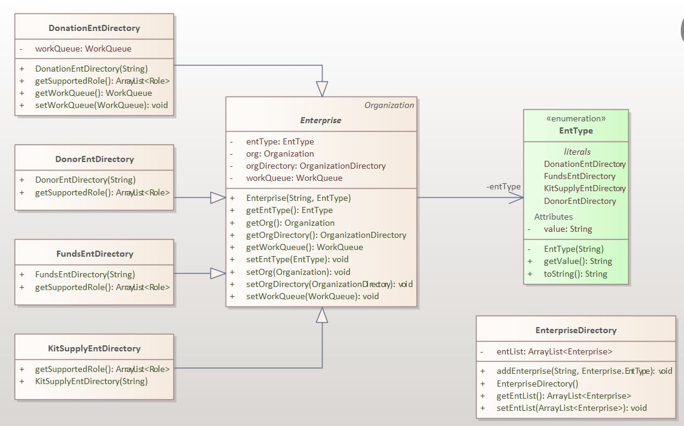
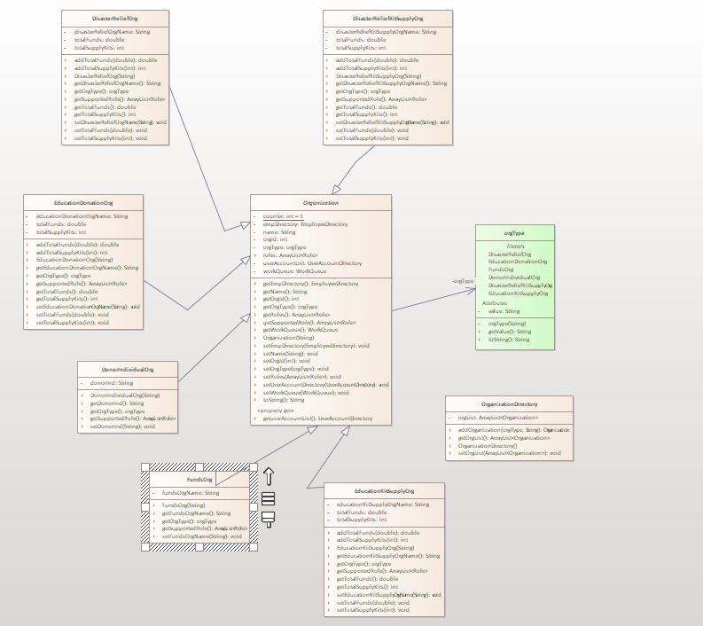
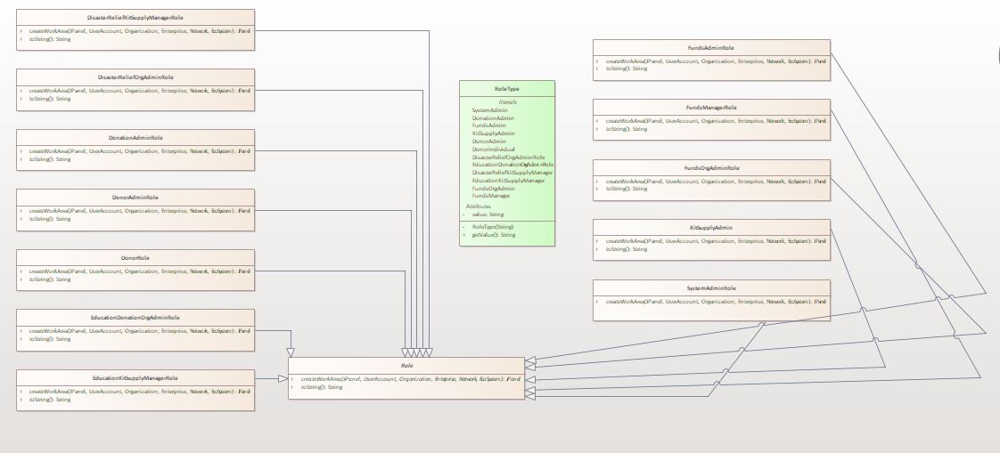
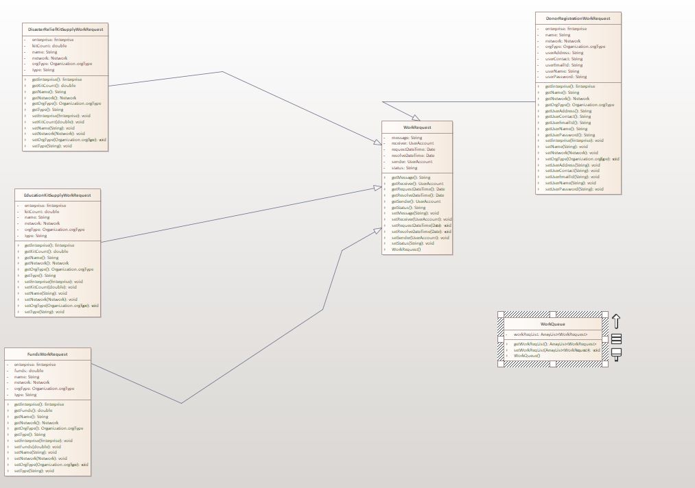
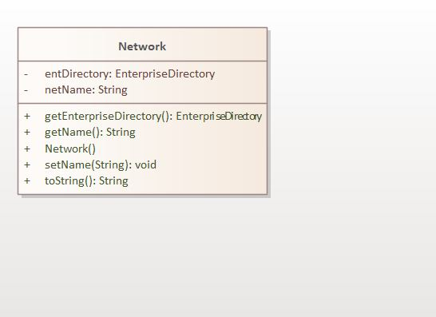
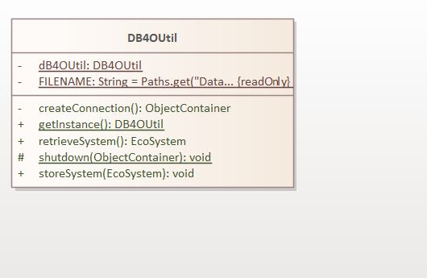
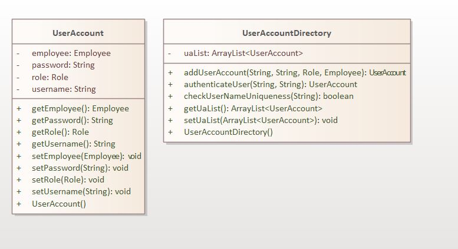

# Donation-Management-System

## Project Description

This is a Java Swing application for Donation Managemnet System.

This project is to manage data for a Donation Managemnet System where the system admin can create various users(admins) who can perform various operations on that data. The purpose of this project is to manage the data of Donation efficiently.

This application will involve communication between enterprises such as Donation Enterprise, Funds Enterprise, Kit Supply Enterprise, Donor Enterprise. These enterprises will include roles such as System Administrator, Donation Admin, Funds Admin, Kit Supply Admin, Donor Admin, Donor, Disaster Relief Org Admin,Education Donation Org Admin, Disaster Relief Kit Supply Manager, Education Kit Supply Manager and Funds Manager.

## Features

The system consists of three types of users.

- **Admins:** They control all the activities and process donations.
- **Donors:** They are the driving users of the application who donate funds and kits.
- **Managers:** They are responsible for accepting and rejecting donations.

Each user should have an account.
Every user also have a dashboard where they can view several things in short summary.
The application provides register, login and logout functionalities.

## Admin Features

Admins receive all the requests made by donors.
Admins can process the donation requests depending upon the details provided by a donor.
Admins can view all the pending donations along with status.
Admins can view all the donations that they have received.

## Donor Features

Donors make the donation request for funds and kits with basic details.
Donor's donation requests can be accepted or rejected and the status can be easily tracked by them.
Donors can update their profile.

## Manager Features

Managers receive all the requests made by donors.
Managers can accept or rejeect the donation requests depending upon the details provided by a donor.
Managers can view all the pending donations along with status.
Managers can view all the donations that are received.

## Additional Features

User gets email confirmation at the time of registration and on successful account creation.
Validators provide real-time validation status in the input field

## Technology used

Java Swing

## Prerequisites

For running the application:

1. Netbeans must be installed.
2. JDK 14 should be installed.

## Instructions to run the project

1. Clone repo https://github.com/Jha-RaushanKumar/Donation-Management-System
2. Install JDK 14.
3. Install netBeans 15.
4. Open project.
5. Build and run the project.

## Enterprise:

Donation Enterprise
Funds Enterprise
Kit Supply Enterprise
Donor Enterprise

## Organization

Disaster Relief Organization
Education Donation Organization
Funds Organization
Individual Donor Organization
Disaster Relief Kit Supply Organization
Education Kit Supply Organization

## Roles:

System Admin
Donation Admin
Funds Admin
Kit Supply Admin
Donor Admin
Donor Individual
Disaster Relief Org Admin
Education Donation Org Admin
Disaster Relief Kit Supply Manager
Education Kit Supply Manager
Funds Org Admin
Funds Manager

## Object model:

## Class Diagram:

